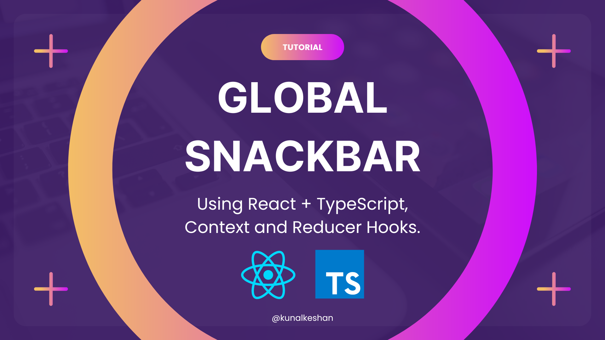

# Learn How to use Context and Reducer Hooks in React.js by Creating a Global Snackbar 🚀

Discover the power of Context & Reducer Hooks in React.js by creating a global snack bar using TypeScript and bootstrapping with Vite.

<p align="center">
    <a href="https://blog.kunalkeshan.dev/learn-how-to-use-context-and-reducer-hooks-in-reactjs-by-creating-a-global-snackbar" style="display: block;" align="center">
        
        <p>Click to Read!</p>
    </a>
</p>

---

**Table of Contents**:

- [Introduction ✊](#introduction)
- [Getting Started ⚡](#getting-started)
- [License 🪪](#license)
- [Contributing 📥](#contributing)

---

## Introduction

This repository is part of the [Learn How to use Context and Reducer Hooks in React.js by Creating a Global Snackbar](https://blog.kunalkeshan.dev/learn-how-to-use-context-and-reducer-hooks-in-reactjs-by-creating-a-global-snackbar) article and illustrates the following.

- Setting up an React.js + TypeScript App using Vite.
- Using the `createContext` and `useContext` hooks.
- Using the `useReducer` hook.
- Using the implementation to create a Global Snackbar.

The idea is understand how Context and Reducer Hooks can be used in a combination to create your own Global State management System to avoid issues like Prop Drilling.

This project creates a very raw implementation of a snackbar using only the hooks and no external libraries.

## Getting Started

- Fork or clone this repository.

```bash
git clone https://github.com/kunalkeshan/global-snackbar-with-react-typescript-context.git
```

- Using `npm` or `yarn` install the dependencies.

```bash
# Using npm
npm i

# Using yarn
yarn
```

- Start the application

```bash
# Using npm
npm run dev

# Using yarn
yarn run dev
```

## License

This project is licensed under the [MIT License](./LICENSE).

## Contributing

You're free to contribute and make changes required to this project. Make sure to follow the [Getting Started](#getting-started) before making any changes.
